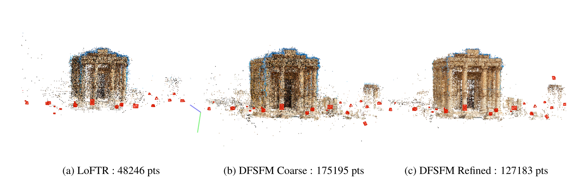

# Niranjan Thanikachalam -- Portfolio

	<a href="https://github.com/tniranjan" aria-label="GitHub" target="_blank" rel="noopener noreferrer">
		<svg viewBox="0 0 16 16" aria-hidden="true" focusable="false">
			<path d="M8 0C3.58 0 0 3.58 0 8c0 3.54 2.29 6.53 5.47 7.59.4.07.55-.17.55-.38 0-.19-.01-.82-.01-1.49-2.01.37-2.53-.49-2.69-.94-.09-.23-.48-.94-.82-1.13-.28-.15-.68-.52-.01-.53.63-.01 1.08.58 1.23.82.72 1.21 1.87.87 2.33.66.07-.52.28-.87.5-1.07-1.78-.2-3.64-.89-3.64-3.95 0-.87.31-1.59.82-2.15-.08-.2-.36-1.02.08-2.12 0 0 .67-.21 2.2.82a7.66 7.66 0 0 1 4 0c1.53-1.04 2.2-.82 2.2-.82.44 1.1.16 1.92.08 2.12.51.56.82 1.27.82 2.15 0 3.07-1.87 3.75-3.65 3.95.29.25.54.73.54 1.48 0 1.07-.01 1.93-.01 2.2 0 .21.15.46.55.38A8.01 8.01 0 0 0 16 8c0-4.42-3.58-8-8-8z"/>
		</svg>
		GitHub
	</a>
	<a href="https://www.linkedin.com/in/niranjanthanikachalam/" aria-label="LinkedIn" target="_blank" rel="noopener noreferrer">
		<svg viewBox="0 0 16 16" aria-hidden="true" focusable="false">
			<path d="M0 1.15C0 .52.52 0 1.15 0h13.7C15.48 0 16 .52 16 1.15v13.7c0 .63-.52 1.15-1.15 1.15H1.15A1.15 1.15 0 0 1 0 14.85V1.15zM4.75 13.2V6.1H2.39v7.1h2.36zm-1.18-8.07c.82 0 1.33-.54 1.33-1.22-.02-.7-.51-1.22-1.31-1.22-.8 0-1.33.52-1.33 1.22 0 .68.51 1.22 1.29 1.22h.02zm10.06 8.07V9.24c0-2.12-1.13-3.1-2.64-3.1-1.22 0-1.77.67-2.08 1.14V6.1H6.56c.03.79 0 7.1 0 7.1h2.35V9.23c0-.21.01-.41.08-.56.16-.41.52-.84 1.14-.84.8 0 1.12.62 1.12 1.53v3.84h2.38z"/>
		</svg>
		LinkedIn
	</a>
	<a href="mailto:tniranjan@duck.com" aria-label="Email">
		<svg viewBox="0 0 16 16" aria-hidden="true" focusable="false">
			<path d="M0 4a2 2 0 0 1 2-2h12a2 2 0 0 1 2 2v.22l-8 4.89-8-4.89V4zm0 1.38v6.62a2 2 0 0 0 2 2h12a2 2 0 0 0 2-2V5.38L8.42 10.3a1 1 0 0 1-1.04 0L0 5.38z"/>
		</svg>
		Email
	</a>

I am a Computer Vision engineer interested in 3D reconstruction, segmentation, inverse rendering, inverse problems and numerical optimization.

---

<h3>Semantic Segmentation for Surface Condition and Defect Detection</h3>

2023 – Present

<figure class="project-media">
<video controls preload="none" playsinline poster="assets/images/segmentation.png">
<source src="assets/videos/segmentation_optimized.mp4" type="video/mp4">
</video>
<figcaption>Condition analysis results.</figcaption>
</figure>

We aim at detecting surface defects, anomalies and events on Artmyn's multimodal gigapixel digital twins. We worked with external experts to develop a small and sparse, but precisely annotated dataset. For training, we leveraged distribution aware resampling, heavy augmentations, a weighted loss function, selective masking, and elements of weakly supervised and semi-supervised learning in order to develop a zoo of semantic segmentation models. At gigapixel scales getting consistent predictions without compromising precision or recall is not trivial, so during inference in addition to severe test-time augmentations, we also ensemble the models via majority voting.

---

<h3>Differentiable Rendering for Spatially-Varying Reflectance Estimation</h3>

2022 – 2024

<figure class="project-media">
<video controls preload="none" playsinline poster="assets/images/svbrdf.png">
<source src="assets/videos/svbrdf_optimized.mp4" type="video/mp4">
</video>
<figcaption>Specular reflectance example.</figcaption>
</figure>

An aspect of real world objects that is often ignored in 3D-reconstructions is reflectance capture. The visual richness of material textures in real world arises from the way light interacts with the surface roughness of the object, resulting in cues we perceive such as matte, glossy, shiny. To effectively estimate this reflectance, I built a differentiable renderer for inverse rendering, partially inspired by the idea behind NeRF. The resulting reflectance model brought drastic realism improvements, particularly for objects composed of multiple classes of materials. 

---

<h3>Gigapixel-Scale Multi-Modal Capture and Processing Pipeline</h3>

2021 – 2023

<figure class="project-media">
<video controls preload="none" playsinline poster="assets/images/pipeline.png">
<source src="assets/videos/pipeline_optimized.mp4" type="video/mp4">
</video>
<figcaption>Gigapixel scale multimodal model.</figcaption>
</figure>

Artmyn's multimodal imaging pipeline operates at 2000ppi, producing gigapixel assets. This comes with several challenges. Consistent image registration is a big challenge, particularly across regions with repeating patterns, which can occur surprisingly often in paintings. To overcome this, I built CRAFT, an inhouse adaptation of the RAFT optical flow CNN, where we added a real geometry encoder based on estimated depth and transfer learnt on synthetic data, resulting in a reduction of failure rates from 20% to under 1%. Accurate depth estimation at these scales is also non-trivial. I cast the problem as a large scale inverse problem with priors from both photometric cues and stereo displacement to improve depth estimation drastically. I also contributed heavily to proper camera sensor and color calibration models resulting in extremely high fidelity digital twins.

---

<h3>3D Reconstruction in the Wild </h3>

2024 . CS231N

<figure class="project-media">

<figcaption>3D reconstruction in the wild.</figcaption>
</figure>

This was a research project for the course CS231N - Deep Learning for Computer Vision at Stanford Online. In this project the problem of Phototourism - i.e recreating a 3D model of the real world from unstructured set of photographs is considered from a deep learning perspective. The work explores the use of deep learning components in the classical structure from motion pipeline. It also explores the replacement of the optimization component bundle adjustment using the recently proposed DBARF, a generalized NERF inspired neural rendering method that simultaneously optimizes camera pose and image rendering. It is seen that while deep-learning components are in general successful in improving the feature description and matching stage, even neural rendering methods that _optimize_ instead of learn, fail to achieve the accuracy of bundle adjustment.

[Report](assets/docs/3D_Reconstruction_in_the_Wild.pdf)

<h3> Exploring the capability of Tiny Language Models for story telling for resource constrained languages</h3>

2025 . CS224N

<figure class="project-media">
<video controls preload="none" playsinline poster="assets/images/pipeline.png">
<source src="assets/videos/pipeline_optimized.mp4" type="video/mp4">
</video>
<figcaption>Gigapixel scale multimodal model.</figcaption>
</figure>

This was a research project for the course CS224N - Natural Language Processing at Stanford Online. In this study, we are interested in Tamil language models that can tell stories with the same complexity as told to toddlers and young children. To build such a model we created a machine translated version of the TinyStories dataset with 1M stories in the train split. We then explore GPTNeo and Llama models of differing sizes, all less than 150M parameters to learn story telling. We take a three stage approach, where the model is first pretrained on internet quality Tamil data. Next the machine translated dataset is used for continual training. Followed by this we run a final fine tuning run with a very small expert curated dataset of 2000 stories in the train split. We also attempt LoRA fine tuning of an English language GPTNeo model. We see that while the models are able to tell stories, they are not of high quality, mainly arising from the low-quality of machine translations. Some of the resulting models are small enough at less than 100MB and can easily run on your browser. Head over to the project site to give it a try.

[Report](assets/docs/CS224N__Project_Final_Report-5.pdf) [Project Page](https://tniranjan.github.io/kurunkathai)
